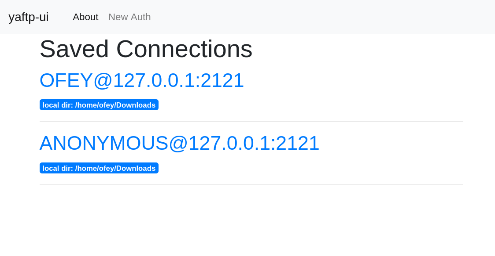
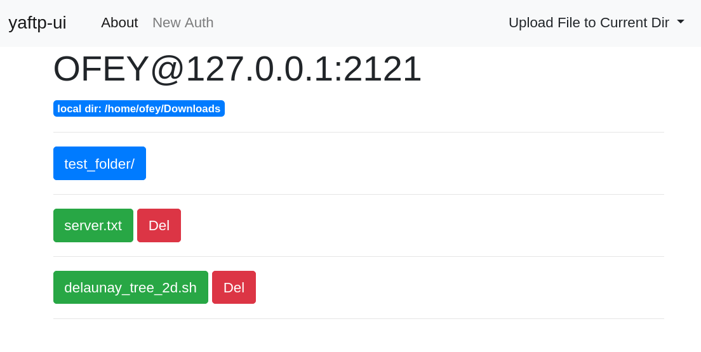
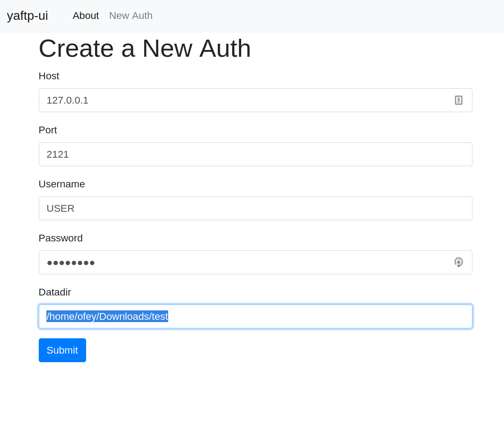

# yaftp-ui: Web User Interface of Yet anoter file transfer protocol

`yaftp` package: https://github.com/ofey404/yaftp

## Usage

```bash
git clone https://github.com/ofey404/yaftp-ui.git
cd yaftp-ui
```

Start a yaftp server for test:

```bash
$ make server
python scripts/set_up_server.py
24565 - [DEBUG] - 21-01-01 23:20:53 - Using selector: EpollSelector
```

Run in another terminal:

```bash
$ make run
./scripts/clear.sh
./scripts/run.sh
 * Environment: production
   WARNING: This is a development server. Do not use it in a production deployment.
   Use a production WSGI server instead.
 * Debug mode: off
 * Running on http://127.0.0.1:5000/ (Press CTRL+C to quit)
```

Visit http://127.0.0.1:5000/



- Click file name to download
- Click folder name to change dir
- Click local file name in dropdown menu top-right corner to upload file



Add Other authentications:
